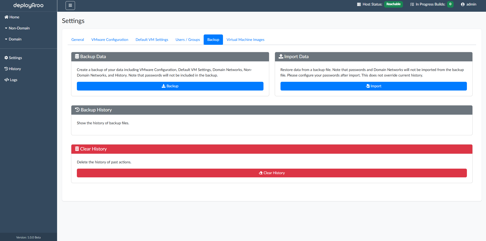

# Backup and Restore

## 1. Accessing Backup and Restore Functions

### Navigate to Backup Settings

1. **Access Settings Menu:**
    * Locate and click on the **Settings** option in the main navigation menu.

2. **Navigate to Backup Section:**
    * Within the Settings menu, find and select the **Backup** section.

## 2. Creating Backups

### Safeguard Your Deployaroo Data

1. **Locate Backup Data Option:**
    * In the Backup section, find the `Backup Data` area.

2. **Initiate Backup Process:**
    * Click the `Create Backup` button to start the backup creation process.

3. **Retrieve Backup File:**
    * Once the backup is complete, navigate to the `Backup History` section within the same page.
    * Locate your newly created backup in the list.
    * Click the download option next to the backup to save it to your local system.

## 3. Restoring from Backups

### Recover Your Deployaroo Configuration

1. **Access Import Data Function:**
    * Within the Backup section, find the `Import Data` area.

2. **Select Backup for Restoration:**
    * Click to browse your local system and select the backup file you wish to restore from.

3. **Initiate Restore Process:**
    * After selecting the backup file, click `Open` to begin the restoration process.
    * Wait for the process to complete. This may take a few moments depending on the size of your backup.

## 4. Managing Deployment History

### Clear Deployment Records

> **Note:** Clearing history affects only the record of past VM deployments. Your current configuration settings will remain intact.

1. **Access History Management:**
    * Within the Backup section, locate the history clearing option.

2. **Clear Deployment History:**
    * Find and click the `Clear History` button to initiate the history clearing process.
    * Confirm your action if prompted.

## Next Steps

After managing your backups and restores, consider:

* [View Logs](../../admin-guide/logs)
* [View History](../../admin-guide/history)

---

**Simplify your VM deployments with Deployaroo**

[Get Started](getting-started/overview.md) | [View Demo (Coming soon)](#) | [Report Bug](https://github.com/blink-zero/deployaroo/issues) | [Request Feature](https://github.com/blink-zero/deployaroo/issues)
