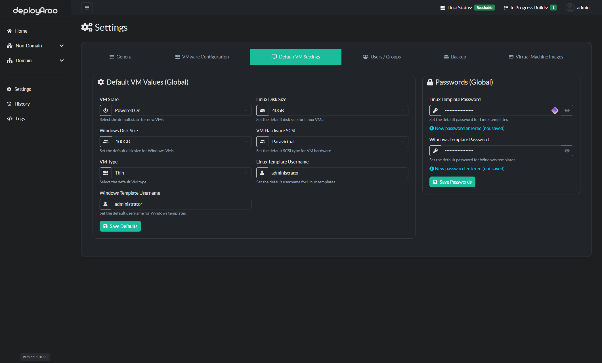

# Default VM Settings

## 1. Accessing Default VM Settings

### Navigate to Default VM Configuration

> **Tip**: Regularly reviewing and updating default VM settings ensures efficient and consistent VM deployments.

1. **Access Settings Menu:**
    * Locate and click on the **Settings** option in the main navigation menu.

2. **Navigate to Default VM Settings:**
    * Within the Settings menu, find and select the **Default VM Settings** section.

## 2. Configuring Default VM Values

### Customize Default Settings for VM Deployments

> **Important:** These default values will be applied to all new VM deployments unless manually overridden during the deployment process.

1. **Review Current Settings:**
    * Examine the existing default values for VMs.

2. **Save Updated Defaults:**
    * After making your changes, locate the **Save Defaults** button.
    * Click **Save Defaults** to update and apply the new settings.

## 3. Setting Template Passwords

### Configure Passwords for Post-Deployment Configuration

> **Note:** These passwords are crucial for Ansible configuration. Ensure they match your VM templates.

1. **Enter Linux Template Password:**
    * Locate the field for Linux template password.
    * Enter the password that matches your Linux VM templates.

2. **Enter Windows Template Password:**
    * Find the field for Windows template password.
    * Input the password that corresponds to your Windows VM templates.

3. **Update Password Settings:**
    * After entering both passwords, find the **Save Passwords** button.
    * Click **Save Passwords** to update and store the new password settings.

## 4. Verifying Updated Settings

### Confirm Changes to Default VM Settings

> **Tip:** Always verify your changes to ensure they've been applied correctly.

1. **Review Updated Values:**
    * After saving, review the displayed default values to confirm your changes.

2. **Test New Defaults:**
    * Consider initiating a test VM deployment to ensure the new default settings are applied correctly.

## Next Steps

After configuring your default VM settings, you may want to:

* [Deploy a New VM](../../admin-guide/deploying-vms)

---

**Simplify your VM deployments with Deployaroo**

[Get Started](getting-started/overview.md) | [View Demo (Coming soon)](#) | [Report Bug](https://github.com/blink-zero/deployaroo/issues) | [Request Feature](https://github.com/blink-zero/deployaroo/issues)
