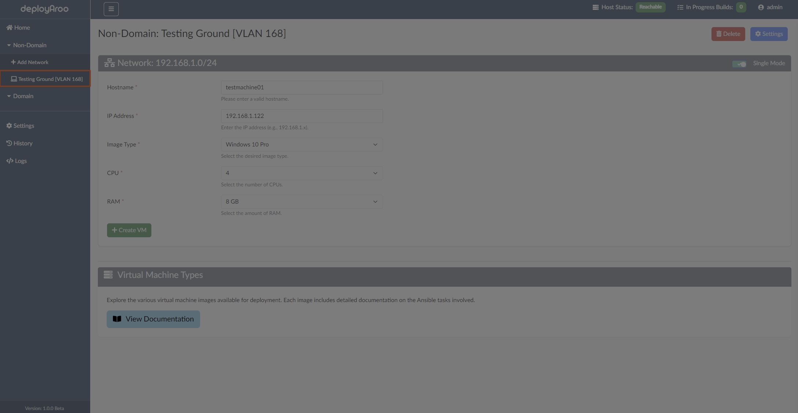
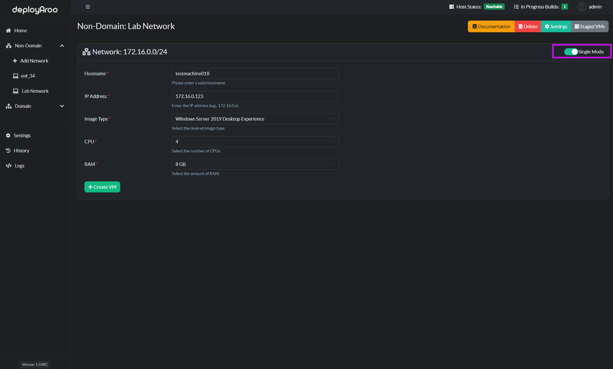
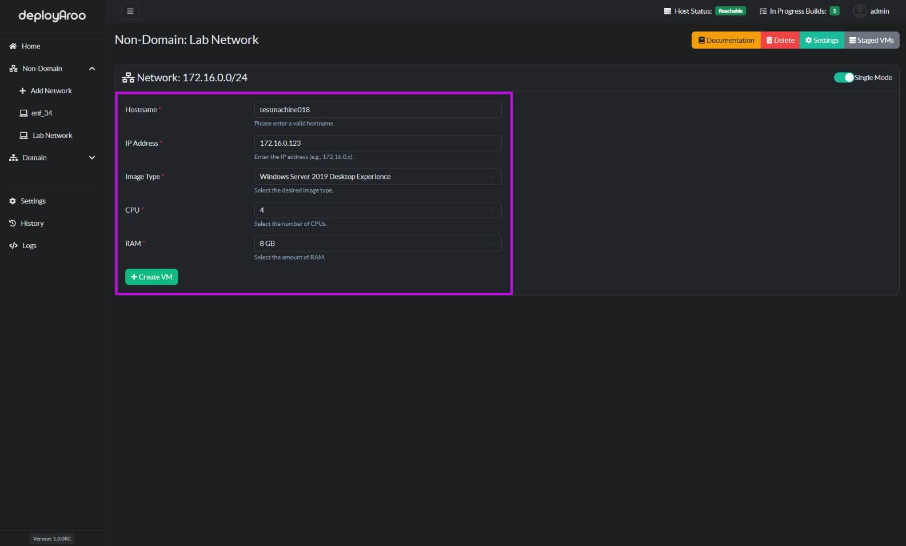
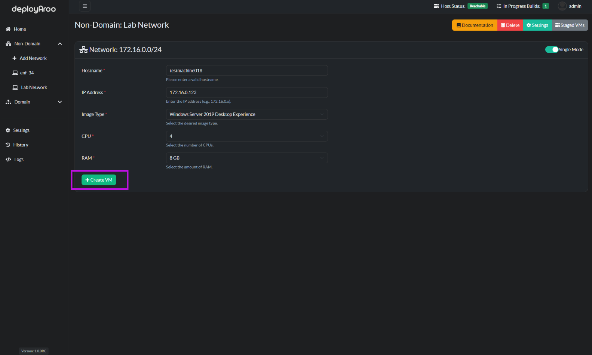
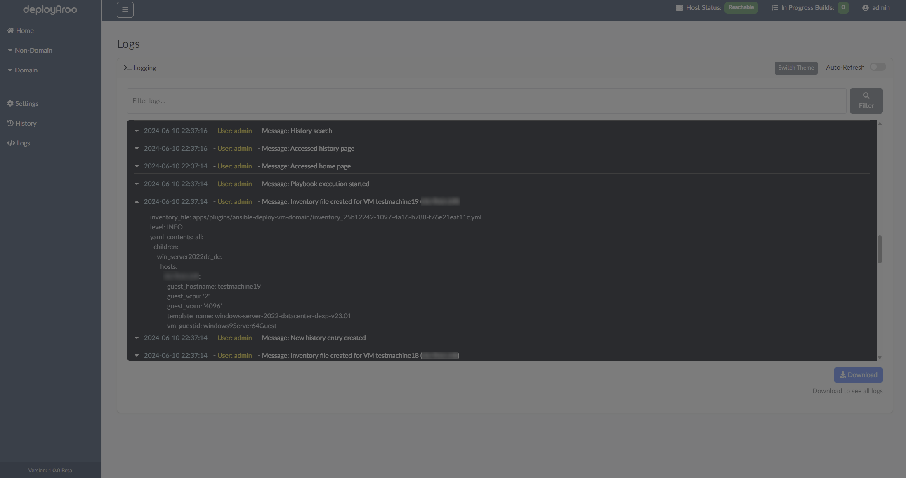

# Deploying Virtual Machines

Deployaroo allows you to deploy virtual machines (VMs) in both non-domain and domain networks. You can choose to operate in single mode or multiple mode for deploying VMs. Follow these detailed steps to deploy your VMs efficiently.

## Steps to Deploy Virtual Machines

1. **Navigate to the Network under Non-Domain or Domain**:

2. **Select Deployment Mode**:
   - Flick the toggle button near the top right of the box to select the mode of operation.
   - You can choose to operate in **Single Mode** or **Multiple Mode**:
     - **Single Mode**: Deploy a single VM.
     - **Multiple Mode**: Stage and Deploy multiple VMs at once.
   *Further details on the modes of operation can be seen below*

3. **Enter VM Details**:
   - Fill in the following required details for each VM:
     - **Hostname**: The name of the VM you want to deploy.
     - **IP Address**: The IP address for the VM.
     - **Image Type**: Select the VM image type from the available options.
     - **CPU**: Number of CPU cores for the VM.
     - **RAM**: Amount of RAM for the VM.

4. **Configure Additional Settings** (if applicable):
   - Depending on your deployment mode and image type, you may need to configure additional settings such as domain information or specific VM information.

5. **Review Configuration**:
   - Double-check all entered details to ensure accuracy.

6. **Deploy the VM(s)**:
   - Click the **Create VM** button to start the deployment process in single mode or click **Stage VM** to stage multiple VMs before ultimately clicking **Deploy VMs**.
   - The app will build the Ansible inventory file and start the deployment of the VMs after this.

## Deployment Modes

### Single Mode

In Single Mode, you deploy one VM at a time:

1. **Select Single Mode** (this is the default setting):
   - Fill in the required details (Hostname, IP Address, Image Type, CPU, RAM).

2. **Deploy the VM**:
   - Click **Create VM** to start the deployment of the single VM.

### Multiple Mode

In Multiple Mode, you can deploy multiple VMs at once:

1. **Select Multiple Mode**:
   - Ensure you are in Multiple Mode.
   - Fill in the required details for each VM and press **Stage VM** once per machine. The VMs will appear in the right side panel with their details.

2. **Deploy the VMs**:
   - Click **Deploy VMs** to start the deployment of all specified VMs. This will create an inventory file per VM and kick off the relevant playbook for all the VMs at once.

## Monitoring Deployment

Once the deployment process is initiated, you can monitor the status of your VMs:

- **History**: Track the progress of your VM deployments in real-time via Ansible logs.

- **Logs**: Access detailed logs to review any issues related to Deployaroo.

---

By following these steps, you can effectively deploy virtual machines in both non-domain and domain environments using Deployaroo.
