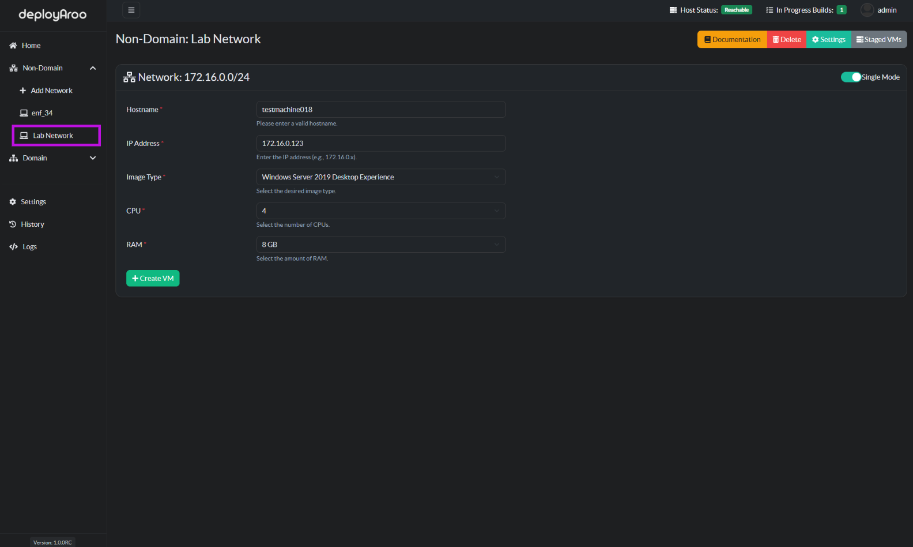

# Deploying Virtual Machines

## 1. Selecting Deployment Environment

### Choose Network Type and Location

> **Tip**: Deployaroo supports VM deployment in both non-domain and domain networks. Ensure you have the correct network configured before proceeding.

1. **Access Network Selection:**
    * Navigate to either the **Non-Domain** or **Domain** section in the left-hand menu, depending on your deployment needs.
    * Select the specific network where you want to deploy your VM(s).

## 2. Choosing Deployment Mode

### Select Single or Multiple VM Deployment

> **Note:** The default setting is Single Mode. Adjust this based on your deployment requirements.

1. **Locate Mode Toggle:**
    * Find the toggle button near the top right of the deployment box.

2. **Select Deployment Mode:**
    * **Single Mode**: For deploying one VM at a time.
    * **Multiple Mode**: For staging and deploying multiple VMs simultaneously.

## 3. Configuring VM Details

### Enter Essential VM Information

> **Important:** Accurate VM details are crucial for successful deployment. Double-check all information before proceeding.

1. **Fill in Required Fields:**
    * **Hostname**: Enter the desired name for the VM.
    * **IP Address**: Specify the IP address for the VM.
    * **Image Type**: Choose the appropriate VM image from available options.
    * **CPU**: Set the number of CPU cores for the VM.
    * **RAM**: Determine the amount of RAM for the VM.

2. **Configure Additional Settings (if applicable):**
    * For domain networks, you may need to enter domain-specific information.
    * Certain image types may require additional configuration.

## 4. Deploying Virtual Machines

### Initiate VM Deployment Process

> **Tip:** In Multiple Mode, stage all desired VMs before initiating deployment.

1. **For Single Mode Deployment:**
    * After entering VM details, click the **Create VM** button to start the deployment process.

2. **For Multiple Mode Deployment:**
    * Enter details for each VM and click **Stage VM**.
    * Repeat for all desired VMs.
    * Once all VMs are staged, click **Deploy VMs** to initiate deployment of all staged VMs.

### Single Mode Deployment

### Multiple Mode Deployment

## 5. Monitoring Deployment Progress

### Track VM Deployment Status

> **Note:** Deployaroo provides real-time updates on deployment progress through various logging features.

1. **Access Deployment History:**
    * Navigate to the **History** section to view real-time progress of VM deployments via Ansible logs.

2. **Review Detailed Logs:**
    * Access the **Logs** section for comprehensive information about the deployment process and any potential issues.

## Next Steps

After deploying your virtual machines, you may want to:

* [Manage VM Images](../../admin-guide/vm-images-management)

---

**Simplify your VM deployments with Deployaroo**

[Get Started](getting-started/overview.md) | [View Demo (Coming soon)](#) | [Report Bug](https://github.com/blink-zero/deployaroo/issues) | [Request Feature](https://github.com/blink-zero/deployaroo/issues)
