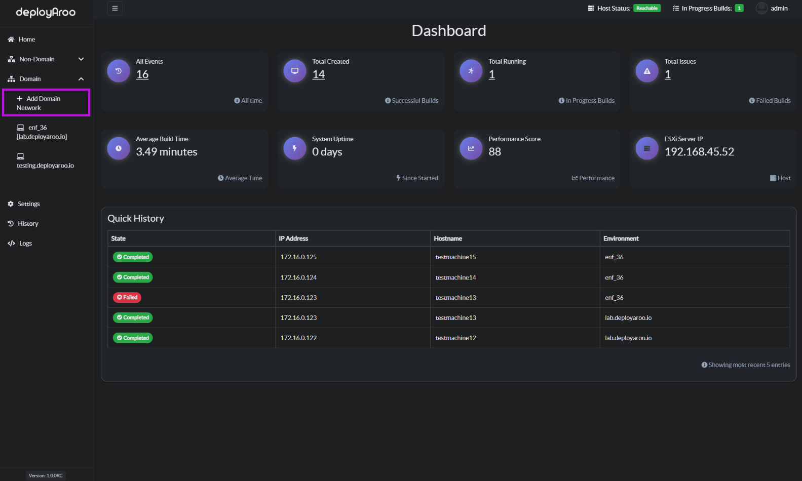
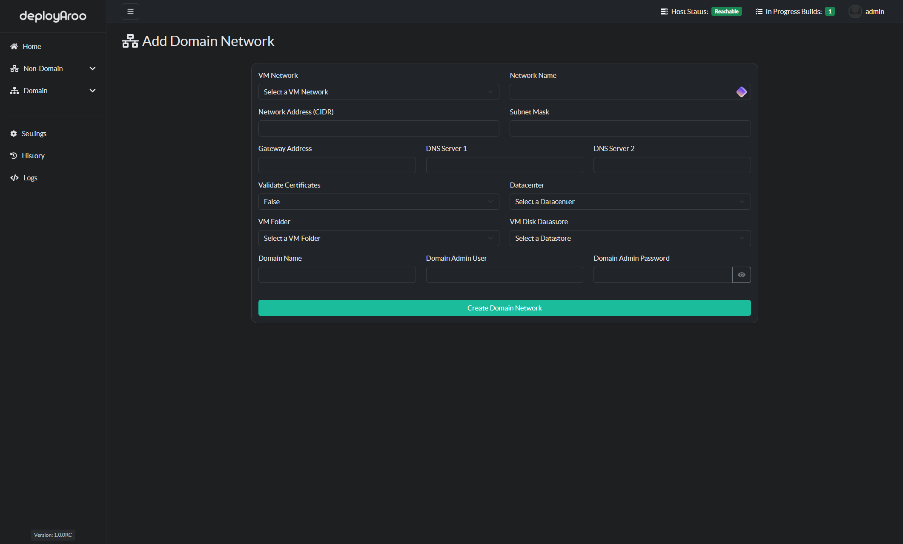

# Adding a Domain Network

To add a Domain network in the Deployaroo app, follow these steps:

1. **Navigate to Domain Networks**:
   - Choose the **Domain** item in the left-hand menu.
   - Select **Add Domain Network**.

2. **Fill in Network Details**:
   - Enter all the relevant details related to the network where you will deploy virtual machines.
   - Customize the name of the network to suit your VMware environment.

3. **Create the Network**:
   - Once all details are entered, press **Create Network** to add the network under the Domain menu item.
   - You can repeat this process for multiple networks, depending on how many you have.

The dropdown menu will be populated with information retrieved from the VMware vCenter API.

---

By following these steps, you can efficiently manage and add domain networks in the Deployaroo application.
