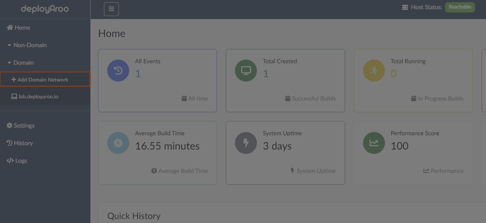
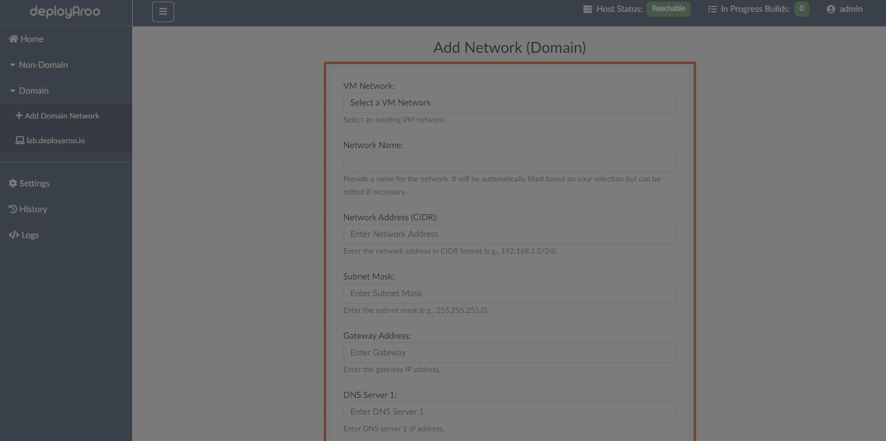

# Adding a Domain Network

## 1. Accessing the Domain Network Settings

### Navigate to Domain Networks

> **Tip**: Ensure you have the necessary permissions to add and manage domain networks before proceeding.

1. **Access the Domain Menu:**
    * Locate and click on the **Domain** item in the left-hand navigation menu.

2. **Initiate Network Addition:**
    * Look for and select the **Add Domain Network** option within the Domain section.

## 2. Configuring Domain Network Details

### Fill in Network Information

> **Important:** Accurate network details are crucial for successful VM deployments in a domain environment. Double-check all information before saving.

1. **Enter Network Specifics:**
    * Fill in all relevant details related to the domain network where you will deploy virtual machines.
    * This may include:
        - Network name
        - IP address range
        - Subnet mask
        - Default gateway
        - DNS servers
        - Domain name
        - Domain controller information

2. **Customize Network Name:**
    * Choose a network name that aligns with your VMware environment naming conventions.
    * Ensure the name is descriptive and easily identifiable for future reference.

## 3. Finalizing Domain Network Creation

### Save and Verify Network Configuration

> **Note:** The dropdown menu in the network configuration form will be populated with information retrieved from the VMware vCenter API.

1. **Create the Network:**
    * After entering all required details, locate and press the **Create Network** button.
    * This action will add the network under the Domain menu item.

2. **Verify Network Addition:**
    * Check that the newly added domain network appears in the list of Domain networks.
    * Confirm that all details are correct as entered.

3. **Add Multiple Domain Networks (Optional):**
    * If needed, repeat this process to add multiple domain networks.
    * Each network can be customized to suit different deployment requirements or domain environments.

## Next Steps

After adding your domain network(s), you may want to:

* [Deploy VMs on Domain Networks](../../admin-guide/deploying-vms)

---

**Simplify your VM deployments with Deployaroo**

[Get Started](getting-started/overview.md) | [View Demo (Coming soon)](#) | [Report Bug](https://github.com/blink-zero/deployaroo/issues) | [Request Feature](https://github.com/blink-zero/deployaroo/issues)
