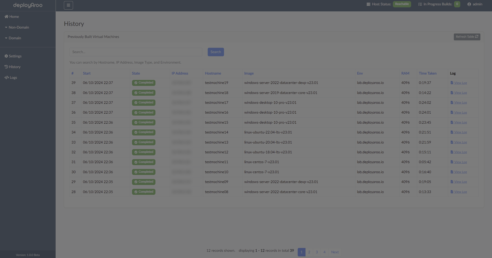
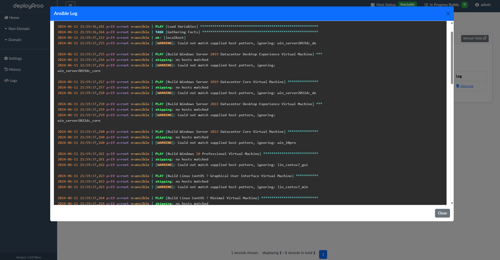

# History

The history section in Deployaroo provides a comprehensive record of all VM deployments. This allows you to track the status, progress, and details of each deployment.

## Accessing History

1. **Navigate to History**:
   - Go to the **History** section from the left-hand menu.

2. **View Deployment History**:
   - The history page displays a list of all deployments, including:
     - **Deployment Date**: The date and time when the deployment was initiated.
     - **VM Details**: Information about the VM, such as hostname, IP address, and image type.
     - **Status**: The current status of the deployment (e.g., completed, in progress, failed).
     - **Time Taken**: The amount of time taken for VM deployment and configuration.

## Detailed Deployment Information

1. **View Details**:
   - Click the `View Log` button next to any deployment entry to see more information.
   - This includes ansible logs and any errors encountered during the deployment.

## Clearing History

This can be done in **Settings > Backup**

1. **Clear Deployment History**:
   - Click the `Clear History` button to delete all deployment history entries.

**Note:** Clearing history will not affect your configuration settings. It only deletes the record of past VM deployments.

---

By regularly reviewing your deployment history, you can track the success and identify any issues with your deployment playbooks.
