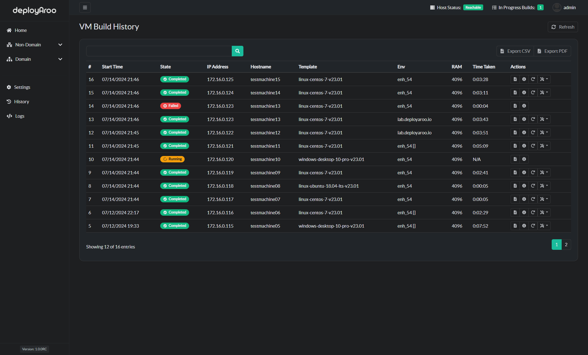
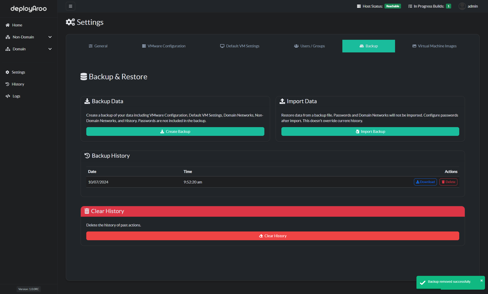

# Deployment History Management

## 1. Understanding Deployment History

### Overview of Deployment Records and Their Importance

> **Tip**: Regular review of deployment history helps in tracking success rates, identifying issues, and improving your deployment processes.

1. **Purpose of Deployment History:**
    * Provides a comprehensive record of all VM deployments.
    * Allows tracking of status, progress, and details of each deployment.
    * Enables post-deployment actions such as increasing disk size, updating the operating system, and changing user passwords.

## 2. Accessing Deployment History

### Navigate to the History Section

> **Note**: Detailed view of each deployment can be accessed by clicking the 'View Details' icon next to each VM.

1. **Access History Menu:**
    * Locate and click on the **History** option in the main navigation menu on the left-hand side.

2. **View Deployment List:**
    * The history page displays a list of all deployments, including:
        - **Deployment Date**: The date and time when the deployment was initiated.
        - **VM Details**: Information such as hostname, IP address, RAM, Environment, and template name.
        - **Status**: The current state of the deployment (e.g., completed, in progress, failed).
        - **Time Taken**: The duration of VM deployment and configuration.

## 3. Viewing Detailed Deployment Information

### Access Comprehensive Deployment Data

1. **View Ansible Log:**
    * Click the `View Log` button next to any deployment entry.
    * Review detailed Ansible logs and any errors encountered during deployment.

2. **View Detailed VM Information:**
    * Click the `View Details` button next to any deployment entry.
    * Examine a comprehensive view of all information related to the selected VM.

## 4. Managing Deployed VMs

### Perform Post-Deployment Actions

1. **Restart a VM:**
    * Locate the `Restart VM` button next to the desired deployment entry.
    * Click to initiate a hard reset of the VM.

2. **Post-Deployment Actions:**
    * Find the post-deployment actions menu for the desired VM.
    * Choose from the following options:
        - **Increase Disk Size**: Expand the VM's storage capacity.
        - **Change User Password**: Update the VM user's credentials.
        - **Update OS**: Perform an operating system update on the VM.

## 5. Clearing Deployment History

### Remove Past Deployment Records

> **Important**: Clearing history only removes deployment records and does not affect your configuration settings or deployed VMs.

1. **Navigate to Backup Settings:**
    * Go to **Settings > Backup** in the main menu.

2. **Clear Deployment History:**
    * Locate the `Clear History` button.
    * Click to delete all deployment history entries.

## 6. Best Practices for History Management

### Optimize Your Deployment Tracking

1. **Regular History Review:**
    * Schedule routine reviews of deployment history to track success rates and identify trends.

2. **Proactive Issue Identification:**
    * Use deployment logs to identify recurring issues or inefficiencies in your deployment process.

3. **Performance Monitoring:**
    * Analyze deployment times and success rates to optimize your VM deployment strategies.

4. **Documentation:**
    * Use the detailed VM information for documentation and auditing purposes.

---

**Simplify your VM deployments with Deployaroo**

[Get Started](getting-started/overview.md) | [View Demo (Coming soon)](#) | [Report Bug](https://github.com/blink-zero/deployaroo/issues) | [Request Feature](https://github.com/blink-zero/deployaroo/issues)
