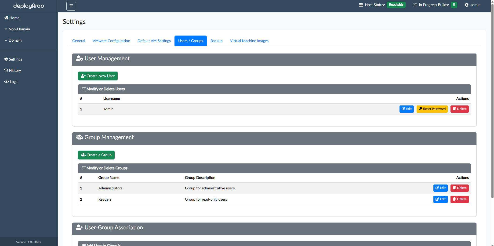

# User and Group Management

## 1. Accessing User and Group Management

### Navigate to Management Settings

> **Tip**: Regular review of user and group settings helps maintain proper access control and security in your Deployaroo environment.

1. **Access Settings Menu:**
    * Locate and click on the **Settings** option in the main navigation menu.

2. **Navigate to User/Group Management:**
    * Within the Settings menu, find and select the **Users / Groups** section.

## 2. Managing Users

### Create New Users

> **Note:** When a new user is created, they are automatically assigned 'Reader' permissions.

1. **Navigate to User Management:**
    * Within the Users / Groups section, locate the `User Management` area.

2. **Create a New User:**
    * Click the `Create New User` button.
    * Enter the following details:
        - Username
        - Password
    * Click `Create User` to finalize the user creation.

### Edit Existing Users

> **Important:** Editing a user allows you to change their username.

1. **Modify User Details:**
    * Find the user you wish to edit in the user list.
    * Click the `Edit` button next to the username.
    * Modify the username as needed.
    * Click `Save changes` to apply the modifications.

### Reset User Passwords

> **Tip:** Use the password generation feature for creating strong, random passwords.

1. **Initiate Password Reset:**
    * Locate the user whose password needs resetting.
    * Click the `Reset Password` button next to their username.

2. **Set New Password:**
    * Enter the new password in the **New Password** field.
    * Confirm the password in the **Confirm New Password** field.
    * Alternatively, use the `Generate` button to auto-fill both fields with a strong password.

3. **Complete Reset:**
    * Click `Reset Password` to apply the new password.

### Delete Users

> **Note:** The first user created during Deployaroo's initial deployment cannot be removed.

1. **Remove a User:**
    * Find the user you wish to delete in the user list.
    * Click the `Delete` button next to their username.
    * In the confirmation dialog, review the user details.
    * Click `Delete` to permanently remove the user.

## 3. Managing Groups

### Understanding Default Groups

> **Important:** Deployaroo comes with two default groups: Administrators and Readers. These groups have predefined permissions that cannot be altered.

* **Administrators:** Have full access to all Deployaroo features.
* **Readers:** Can view history, logs, and the home dashboard, but cannot access settings or deploy virtual machines.

### Create New Groups

1. **Navigate to Group Management:**
    * Within the Users / Groups section, locate the `Group Management` area.

2. **Add a New Group:**
    * Click the `Create a Group` button.
    * Enter the required information for the new group.
    * Click `Create Group` to finalize the group creation.

### Edit Existing Groups

1. **Modify Group Details:**
    * Find the group you wish to edit in the group list.
    * Click the `Edit` button next to the group name.
    * Modify the Group Name and Group Description as needed.
    * Click `Save Changes` to apply the modifications.

### Delete Groups

> **Note:** The default Administrators and Readers groups cannot be removed, even if renamed.

1. **Remove a Group:**
    * Locate the group you wish to delete in the group list.
    * Click the `Delete` button next to the group name.
    * In the confirmation dialog, review the group details.
    * Click `Delete` to permanently remove the group.

## 4. User-Group Association

### Manage User Group Memberships

1. **Add Users to Groups:**
    * Find the user you wish to add to a group.
    * Click the `+ Add to group` button next to the user.
    * Select the desired group from the dropdown menu.
    * Confirm the addition.

2. **Remove Users from Groups:**
    * Locate the user you wish to remove from a group.
    * Click the `- Remove from Group` button next to the user's group membership.
    * Confirm the removal.

## Next Steps

After managing users and groups, you may want to:

* [Conduct a Backup or Restore](../../admin-guide/backup-restore)
* [View Logs](../../admin-guide/logs)
* [View History](../../admin-guide/history)

---

**Simplify your VM deployments with Deployaroo**

[Get Started](getting-started/overview.md) | [View Demo (Coming soon)](#) | [Report Bug](https://github.com/blink-zero/deployaroo/issues) | [Request Feature](https://github.com/blink-zero/deployaroo/issues)
