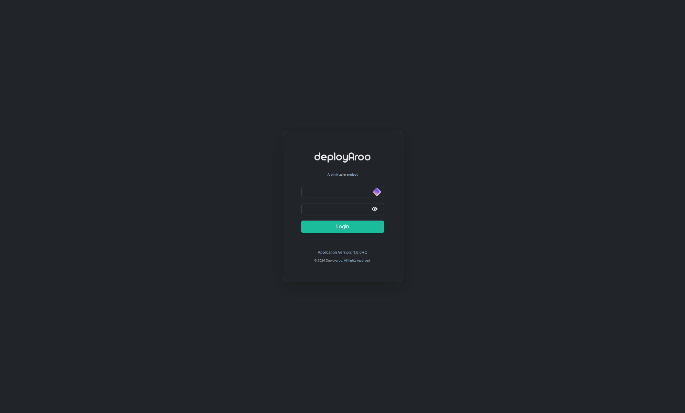

# Using the Application

## 1. Logging In

### Accessing the Application

> **Important:** For security reasons, change your password upon first login. Default credentials should only be used for initial access.

1. **Open the Application:**
    * Navigate to the Deployaroo application URL in your web browser.

2. **Enter Credentials:**
    * Input your username in the 'Username' field.
    * Enter your password in the 'Password' field.

3. **Access the Application:**
    * Click the `Login` button to access your account.

> **Note:** Default credentials are **admin** / **password**

## 2. Navigating the Dashboard

### Understanding the Dashboard Overview

> **Tip:** The dashboard is your central hub for monitoring and managing your virtual machines. Familiarize yourself with its layout for efficient operation.

1. **Access the Dashboard:**
    * After logging in, you'll be automatically directed to the dashboard.
    * If you're on another page, click on the 'Home' option in the main navigation menu.

2. **Review VM Status:**
    * The dashboard displays an overview of all your virtual machines.
    * Each VM's current status (e.g., Running, Completed, Failed) is clearly indicated.

## Next Steps

To learn about more advanced features and operations, please refer to the following guides:

* [Adding a Non-Domain Network](../../admin-guide/non-domain-network)
* [Adding a Domain Network](../../admin-guide/domain-network)
* [Deploying Virtual Machines](../../admin-guide/deploying-vms)

---

**Simplify your VM deployments with Deployaroo**

[Get Started](getting-started/overview.md) | [View Demo (Coming soon)](#) | [Report Bug](https://github.com/blink-zero/deployaroo/issues) | [Request Feature](https://github.com/blink-zero/deployaroo/issues)
