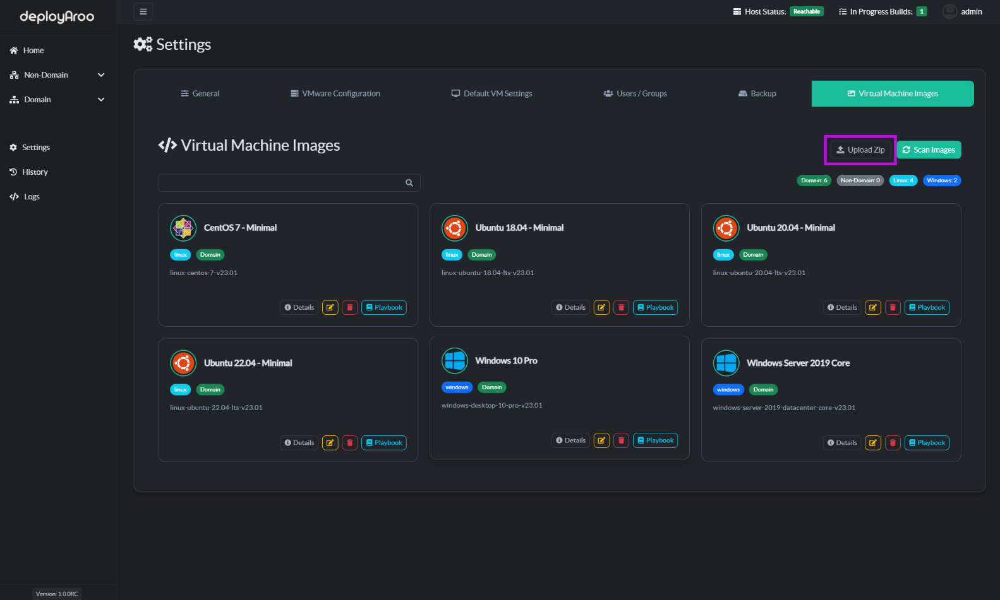
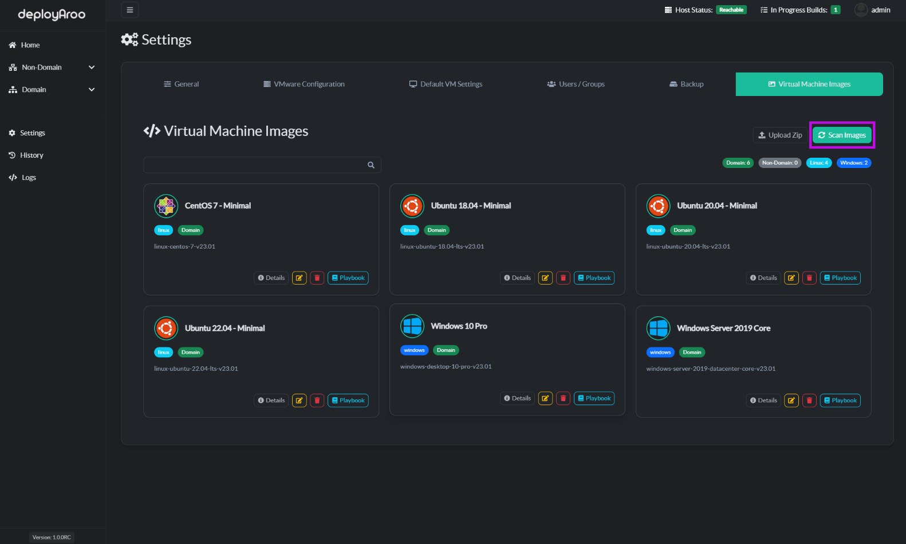
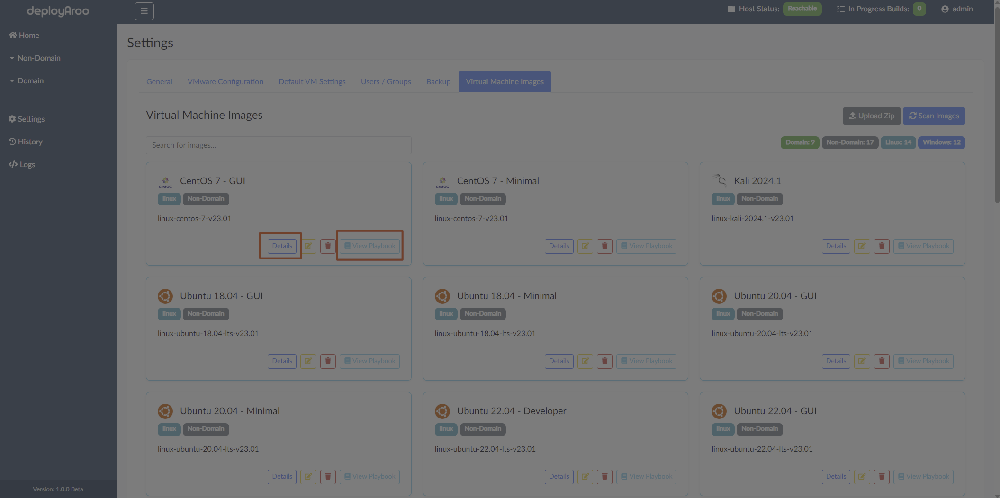
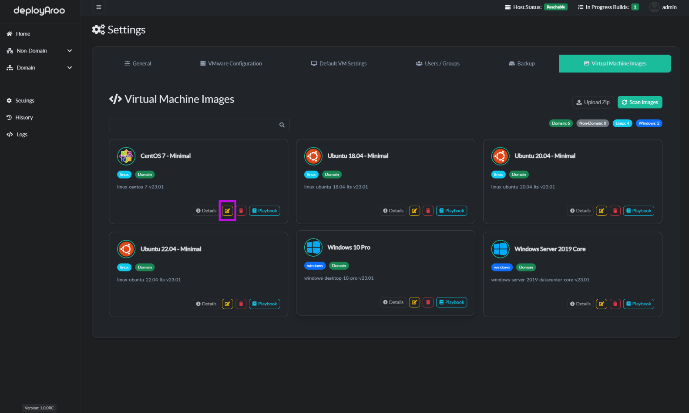

# VM Images Management

Deployaroo comes pre-installed with a variety of default VM images. To view these images, navigate to **Settings > Virtual Machine Images**. Additionally, you can find a repository of confirmed working VM images [here](https://github.com/blink-zero/deployaroo-images). This repository contains default non-domain, domain, and community non-domain and domain playbook images that are pre-zipped. You can upload these if needed.

## Adding VM Images

To add new VM images to Deployaroo, follow these steps:

1. **Navigate to VM Images Section**:
   - Go to **Settings** in the left-hand menu.
   - Select **Virtual Machine Images**.

2. **Upload Zip File**:
   - Click the `Upload Zip` button at the top right of the screen.
   - A file dialog will appear. Navigate to the location of the zip file containing your VM images.
   - Select the zip file and click `Open`. The upload will begin immediately.
   - Once the upload is complete, the new VM images will be added to the list.

## Scanning for Images

To update the list of available VM images by Scanning:

1. **Initiate Scan**:
   - Click the `Scan Images` button at the top right of the **Virtual Machine Images** page.
   - The application will start scanning for new or updated VM images.

2. **Update List**:
   - The scan process will automatically detect and add any new VM images to the list.
   - You will see a notification once the scan is complete, and the list will be refreshed with the latest images.

## Viewing Image Details

To view detailed information about a specific VM image:

1. **Select Image**:
   - On the **Virtual Machine Images** page, find the image you want to view.
   - Click the `Details` button next to the image.

2. **View Details**:
   - A modal window will appear showing detailed information about the VM image, including the image name, template used, and other relevant details.

## Viewing Playbook Details

To view the Ansible playbook associated with a specific VM image:

1. **Select Image**:
   - On the **Virtual Machine Images** page, find the image for which you want to view the playbook.
   - Click the `View Playbook` button.

2. **View Playbook**:
   - A modal window will open displaying the contents of the playbook. This includes all the tasks and configurations defined for the VM image.

## Modifying Images

Currently, you can only modify the human-readable name and the template used by the playbook for each VM image:

1. **Select Image**:
   - On the **Virtual Machine Images** page, find the image you want to modify.
   - Click the `Edit` button.

2. **Modify Details**:
   - In the modal window that appears, you can change the **Human Name** and the **Template Name** fields.
   - Once you have made the desired changes, click `Save changes` to apply the modifications.

## Submitting a Community Image

To contribute a VM image to the community repository:

1. **Prepare Your Image**:
   - Ensure your playbook is fully tested.
   - Create a zip file containing the playbook yml and the settings.json file.
   - Check that the Folder Name doesnt conflict with any other playbooks folder names.

2. **Submit Your Image**:
   - Navigate to the community repository [here](https://github.com/blink-zero/deployaroo-images).
   - Fork the repository to your GitHub account.
   - Add your zip file to the appropriate folder in your forked repository.
   - Commit the changes and create a pull request to the original community repository.

3. **Provide Details**:
   - In the pull request description, provide detailed information about your VM image, including:
     - Image type (non-domain, domain, etc.)
     - Use case
     - Any special configurations
     - Instructions for use

4. **Wait for Review**:
   - Your submission will be reviewed by the repository maintainers.
   - Once approved, your image will be added to the community repository.
   - Documentation site will be updated.

---

By following these steps, you can efficiently manage VM images in Deployaroo, ensuring that your environment is always up-to-date and ready for deployment. Additionally, you can contribute to the community by submitting your own VM images.
