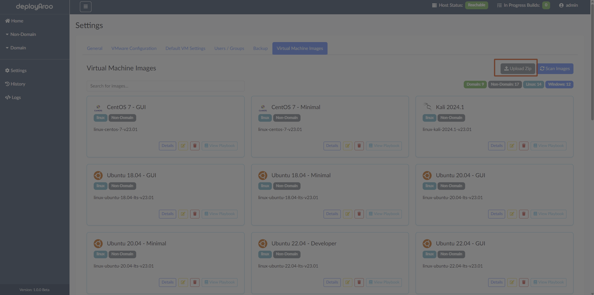
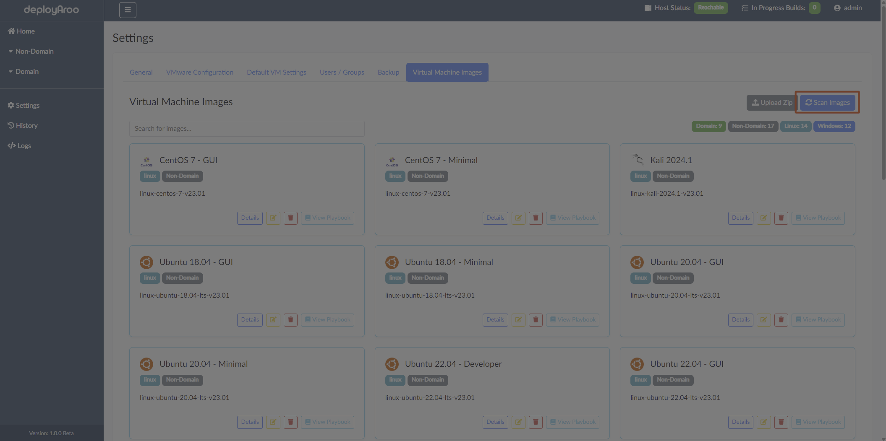
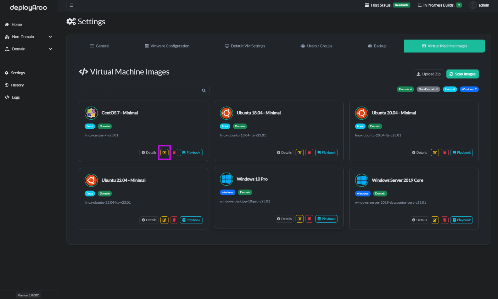
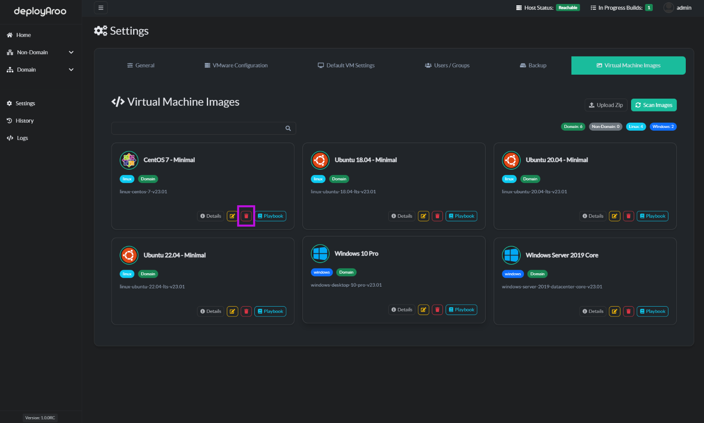

# VM Images Management

## 1. Overview of VM Images

### Understanding Pre-installed and Community Images

> **Tip**: Familiarize yourself with both pre-installed and community images to leverage a wide range of deployment options.

1. **Access Pre-installed Images:**
    * Navigate to **Settings > Virtual Machine Images** to view default VM images.

2. **Explore Community Images:**
    * Visit the [Deployaroo Images Repository](https://github.com/blink-zero/deployaroo-images) for additional pre-zipped images or see the [Download Images](../../download-images) section of this documentation.
    * This documentation includes non-domain, domain, and community playbook images.

## 2. Adding VM Images

### Upload New Images to Deployaroo

> **Important:** Ensure you have the correct zip file containing VM image .yaml and .json before starting the upload process.

1. **Navigate to VM Images Section:**
    * Go to **Settings** in the left-hand menu.
    * Select **Virtual Machine Images**.

2. **Upload Zip File:**
    * Click the `Upload Zip` button at the top right of the screen.
    * In the file dialog, locate and select your VM image zip file.
    * Click `Open` to start the upload process.
    * Wait for the upload to complete and new images to appear in the list.

## 3. Scanning for Images

### Update Available VM Images List

> **Note:** Scanning helps keep your VM image list up-to-date with the latest additions and modifications, A scan is required after intial install of Deployaroo.

1. **Initiate Scan:**
    * On the **Virtual Machine Images** page, click the `Scan Images` button at the top right.
    * The application will begin scanning for new or updated VM images.

2. **Review Updated List:**
    * Wait for the scan to complete. You'll see a notification when it's done.
    * The list will automatically refresh to show the latest images.

## 4. Managing Image Details

### View and Modify Image Information

> **Tip:** Regularly review image details to ensure they align with your deployment needs.

1. **View Image Details:**
    * On the **Virtual Machine Images** page, find the desired image.
    * Click the `Details` button next to the image.
    * Review the information in the modal window that appears.

2. **View Playbook Details:**
    * Locate the image whose playbook you want to view.
    * Click the `View Playbook` button.
    * Examine the playbook contents in the modal window.

3. **Modify Image Details:**
    * Find the image you want to modify and click the `Edit` button.
    * In the modal window, update the **Human Name** and **Template Name** fields as needed.
    * Click `Save changes` to apply your modifications.

## 5. Deleting Images

### Remove Unwanted VM Images

> **Important:** Deleting an image is irreversible. Ensure you no longer need the image before proceeding.

1. **Select Image for Deletion:**
    * On the **Virtual Machine Images** page, locate the image to be deleted.
    * Click the `Delete` button next to the image.

2. **Confirm Deletion:**
    * In the confirmation modal, review the image details.
    * Click `Delete` to permanently remove the image.

## 6. Contributing Community Images

### Submit Your VM Image to the Community Repository

> **Tip:** Contributing to the community repository helps expand the range of available images for all Deployaroo users.

1. **Prepare Your Image:**
    * Thoroughly test your playbook.
    * Create a zip file containing the playbook yml and settings.json file.
    * Ensure the folder name doesn't conflict with existing playbooks.

2. **Submit Your Image:**
    * Visit the [Deployaroo Images Repository](https://github.com/blink-zero/deployaroo-images).
    * Fork the repository to your GitHub account.
    * Add your zip file to the appropriate folder in your fork.
    * Commit changes and create a pull request to the original repository.

3. **Provide Submission Details:**
    * In the pull request description, include:
        - Image type (non-domain, domain, etc.)
        - Use case
        - Special configurations (if any)
        - Usage instructions

4. **Await Review:**
    * Repository maintainers will review your submission.
    * Upon approval, your image will be added to the community repository.
    * The documentation site will be updated accordingly.

## Next Steps

After managing your VM images, you may want to:

* [Download Images](../../download-images)

---

**Simplify your VM deployments with Deployaroo**

[Get Started](getting-started/overview.md) | [View Demo (Coming soon)](#) | [Report Bug](https://github.com/blink-zero/deployaroo/issues) | [Request Feature](https://github.com/blink-zero/deployaroo/issues)
