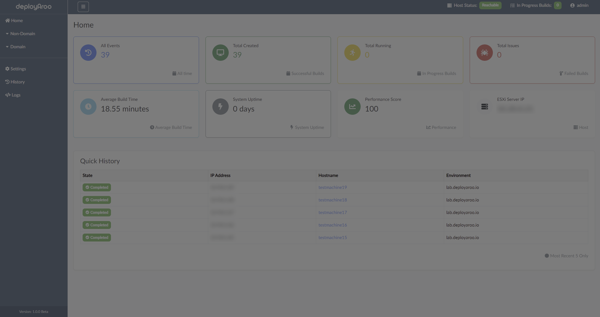

# Overview

---

**Deployaroo** is a sleek and intuitive web interface for deploying VMware vSphere virtual machine templates using Ansible.

## Key Highlights

- **User-Friendly Interface:** Intuitive and easy-to-navigate web interface.
- **Powerful Automation:** Leverages Ansible for seamless automation of VM deployment and management.
- **Comprehensive Management:** Manage VM templates, user permissions, deployment logs, and more.

> **Note:** Ensure all prerequisites are met to guarantee a successful deployment of Deployaroo. VM Templates are mandatory.

---

## Features

- **Simplified VM Deployment:** Quickly deploy VMs with pre-configured templates.
- **Real-Time Monitoring:** Track deployment progress and view detailed logs.
- **Customizable Templates:** Use and manage custom VM templates.
- **User Management:** Control user access and permissions.
- **Template Management:** Create, update, and manage VM templates.
- **Comprehensive Logs:** Access detailed logs for all deployments and actions.

---

  

## Next Step

To get started with Deployaroo, please refer to the [Prerequisites Guide](../prerequisites).