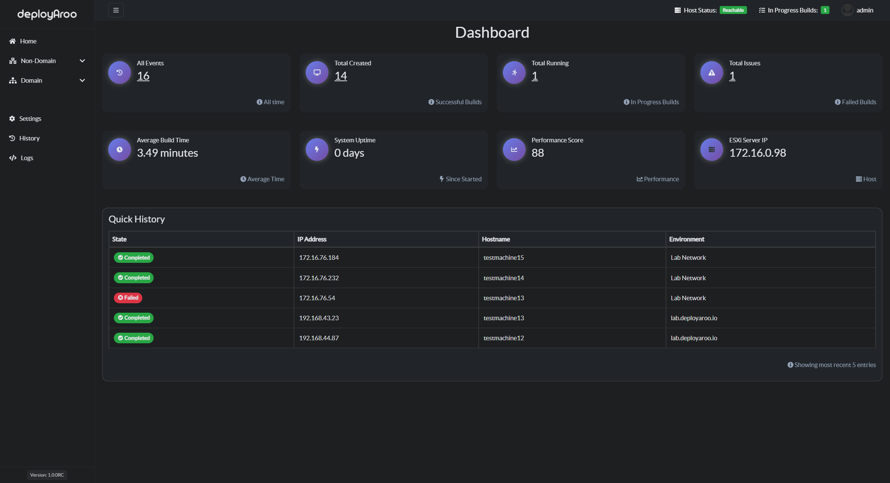

# Welcome to Deployaroo

   
> **🎉 New and Improved Interface! 🎉**  
> Experience the sleeker, more intuitive design for easier VM deployments in this version.

**Deployaroo** is a sleek and intuitive web interface for deploying VMware vSphere virtual machine templates using Ansible.

> v1.0.0 RC now available with a whole bunch of new features!

---

## 🚀 Key Features

- **☁️ Easy VM Creation**: Streamline the process of creating both domain-joined and non-domain virtual machines.
- **📊 Statistics Dashboard**: View statistics related to deployments.
- **📜 Deployment History**: Access records of all running, completed, and failed deployments. View Ansible logs for each deployment.
- **🛠 Post Deployment Actions**: Run post-deployment actions on your deployed VMs, such as expanding disks or updating OS.
- **🔍 Detailed Logs**: Access detailed logs on all events within the application.
- **👥 User Management**: Efficiently manage user access and permissions.
- **💾 Backup & Restore**: Create backups and restore them as needed.
- **🖼️ VM Image Management**: Manage your "VM Images" and upload custom image Ansible playbooks for deployment.
- **⚙️ Flexible Deployment**: Deploy Deployaroo as a Docker container or on a Linux machine.
- **🔔 Notifications**: Receive Discord notifications on your VM deployments using webhooks.

---

## 🏁 Getting Started

To get started with Deployaroo, see the comprehensive [Getting Started Guide](getting-started/overview.md).

---

## 📚 Useful Links

- [📂 GitHub Repo](https://github.com/blink-zero/deployaroo)
- [📖 Documentation](https://deployaroo.io)
- [🖼️ Deployaroo Images](https://github.com/blink-zero/deployaroo-images)

---

## 🤝 Contributing

We welcome contributions! Please read our [contributing guidelines](contributing.md) to get started.

---

## 📸 Screenshot

  

*Deployaroo Dashboard: Streamlined VM deployment at your fingertips*

---

**Simplify your VM deployments with Deployaroo**

[Get Started](getting-started/overview.md) | [View Demo (Coming soon)](#) | [Report Bug](https://github.com/blink-zero/deployaroo/issues) | [Request Feature](https://github.com/blink-zero/deployaroo/issues)
