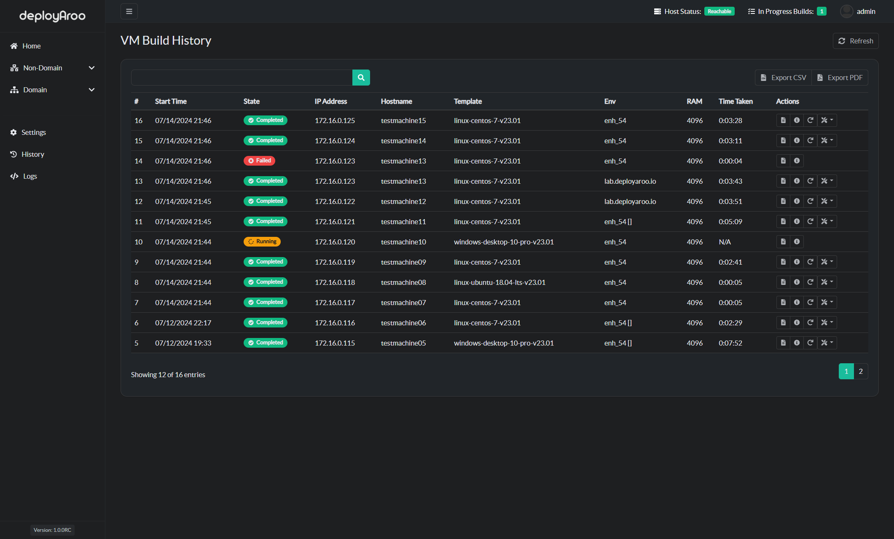
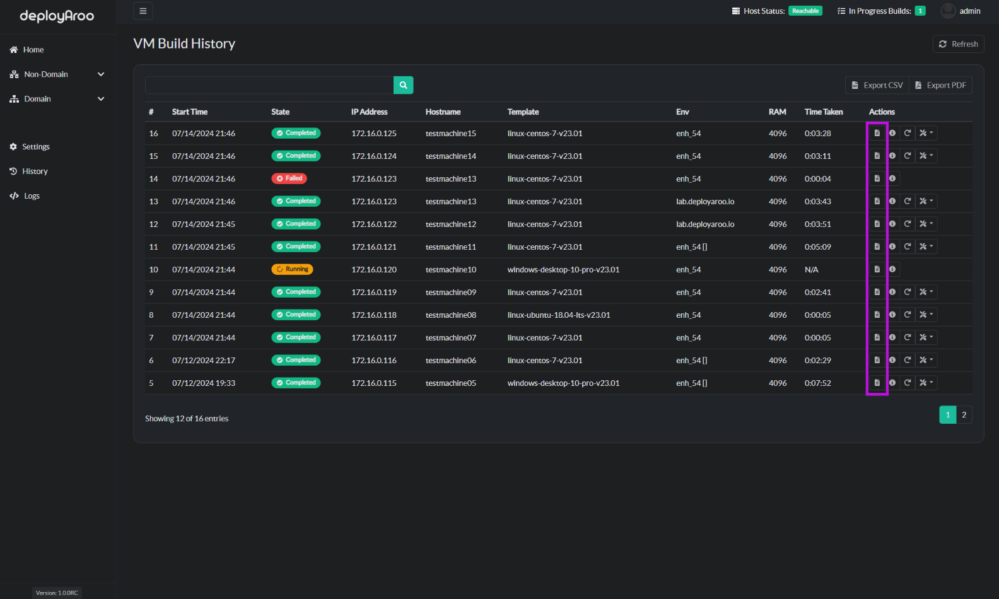
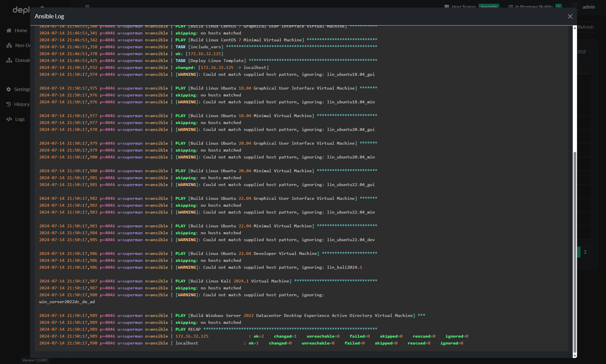
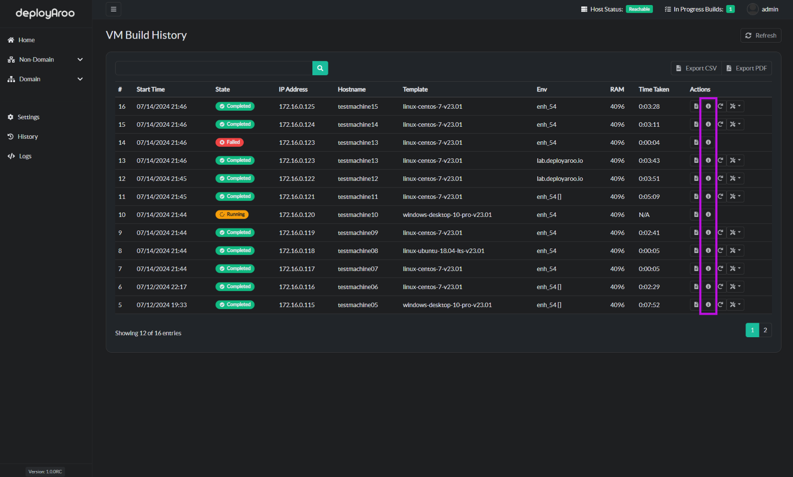
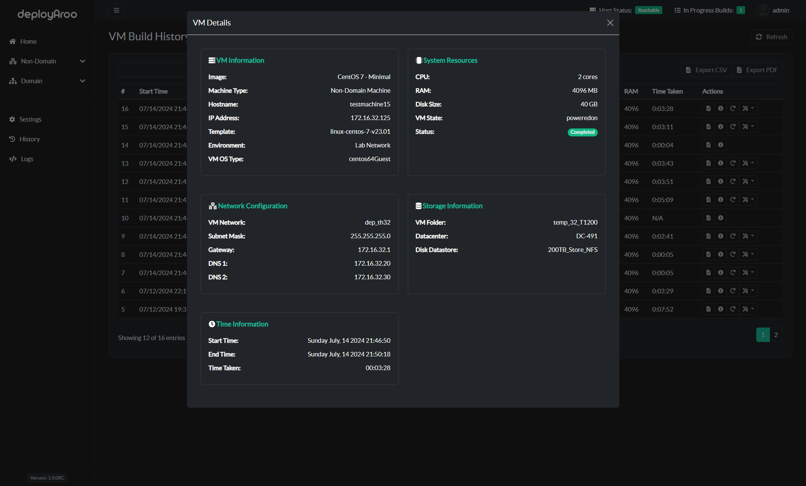
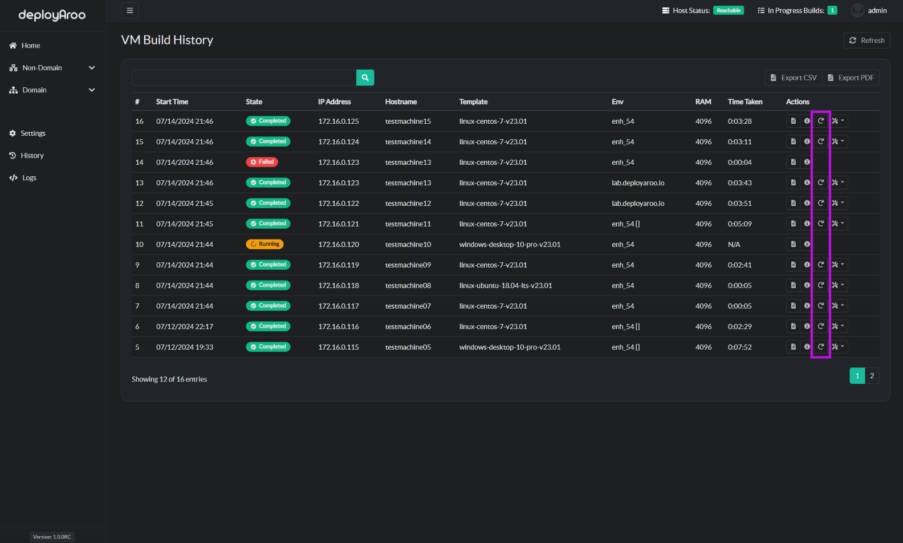
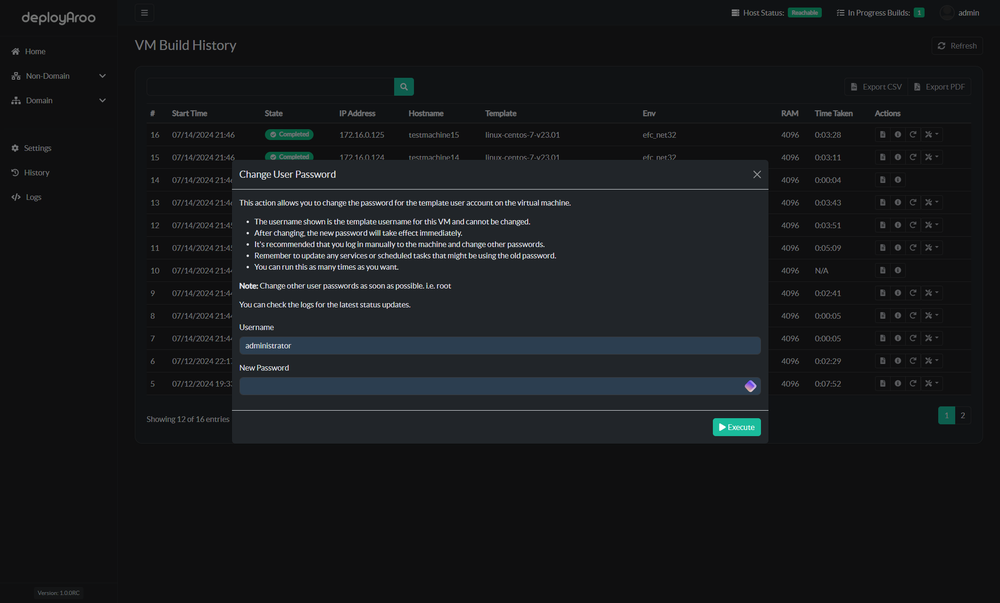

# History

The history section in Deployaroo provides a comprehensive record of all VM deployments. This allows you to track the status, progress, and details of each deployment. You can also do post deployment actions such as increase disk size, update operating system and change user passwords.

## Accessing History

> Note: A detailed view of each deployment can be retrieved by clicking on the the 'View Details' icon next to each VM.

1. **Navigate to History**:
   - Go to the **History** section from the left-hand menu.

2. **View Deployment History**:
   - The history page displays a list of all deployments, including:
     - **Deployment Date**: The date and time when the deployment was initiated.
     - **VM Details**: Information about the VM, such as hostname, IP address, RAM, Environment and template name.
     - **Status**: The current state of the deployment (e.g., completed, in progress, failed).
     - **Time Taken**: The amount of time taken for VM deployment and configuration.

## Ansible Log

1. **View Ansible Log**:
   - Click the `View Log` button next to any deployment entry to see more information.
   - This includes ansible logs and any errors encountered during the deployment.

## Detailed VM Details

1. **View Details**:
   - Click the `View Details` button next to any deployment entry to see a detailed view of all information related to the selected VM.

## Restart VM

1. **Restart a VM**:
   - Click the `Restart VM` button next to any deployment entry to hard reset a VM.

## Post Deployment Actions

1. **Option 1: Increase Disk Size**:
   - Increase Disk Size
2. **Option 2: Change User Password**:
   - Change User Password
3. **Option 3: Update OS**:
   - Update OS

## Clearing History

This can be done in **Settings > Backup**

1. **Clear Deployment History**:
   - Click the `Clear History` button to delete all deployment history entries.

**Note:** Clearing history will not affect your configuration settings. It only deletes the record of past VM deployments.

---

By regularly reviewing your deployment history, you can track the success and identify any issues with your deployment playbooks.

---

**Simplify your VM deployments with Deployaroo**

[Get Started](getting-started/overview.md) | [View Demo (Coming soon)](#) | [Report Bug](https://github.com/blink-zero/deployaroo/issues) | [Request Feature](https://github.com/blink-zero/deployaroo/issues)
