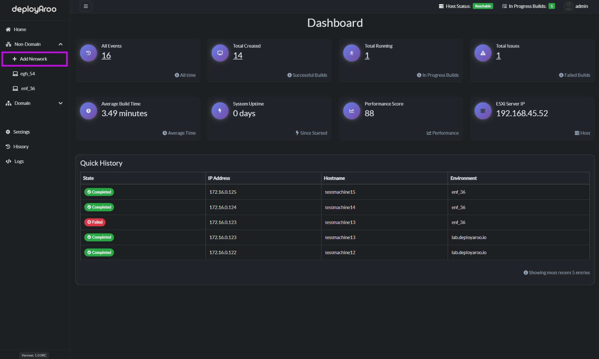
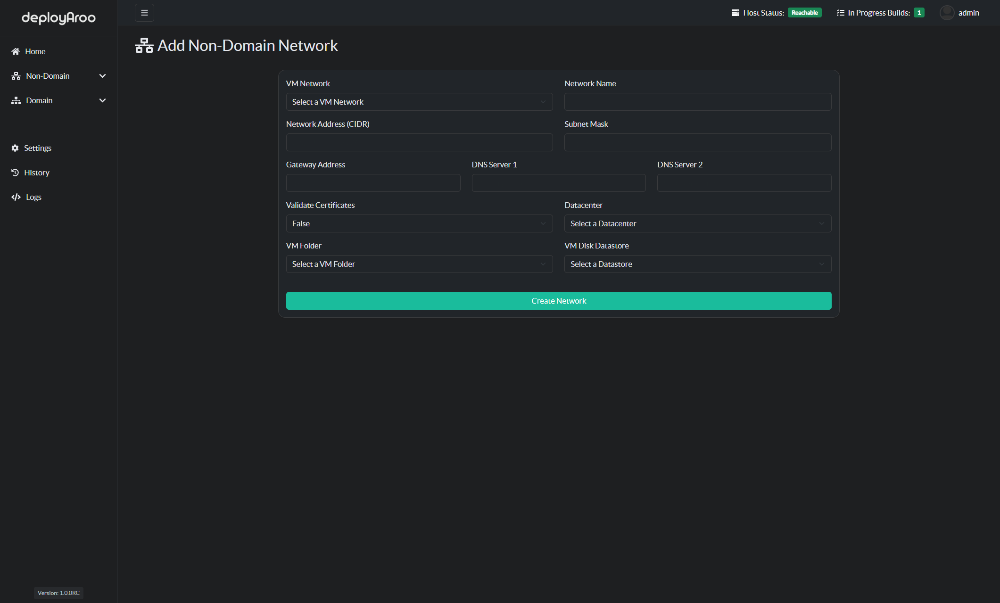

# Adding a Non-Domain Network

To add a Non-Domain network in the Deployaroo app, follow these steps:

1. **Navigate to Non-Domain Networks**:
   - Choose the **Non-Domain** item in the left-hand menu.
   - Select **Add Network**.

2. **Fill in Network Details**:
   - Enter all the relevant details related to the network where you will deploy virtual machines.
   - Customize the name of the network to suit your VMware environment.

3. **Create the Network**:
   - Once all details are entered, press **Create Network** to add the network under the Non-Domain menu item.
   - You can repeat this process for multiple networks, depending on how many you have.

The dropdown items will be populated with information retrieved from the VMware vCenter API.

---

By following these steps, you can efficiently manage and add non-domain networks in the Deployaroo application.

---

**Simplify your VM deployments with Deployaroo**

[Get Started](getting-started/overview.md) | [View Demo (Coming soon)](#) | [Report Bug](https://github.com/blink-zero/deployaroo/issues) | [Request Feature](https://github.com/blink-zero/deployaroo/issues)
