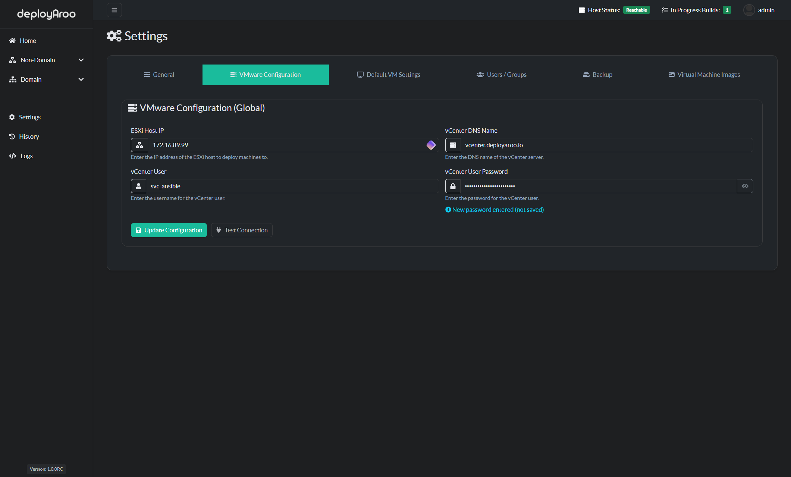
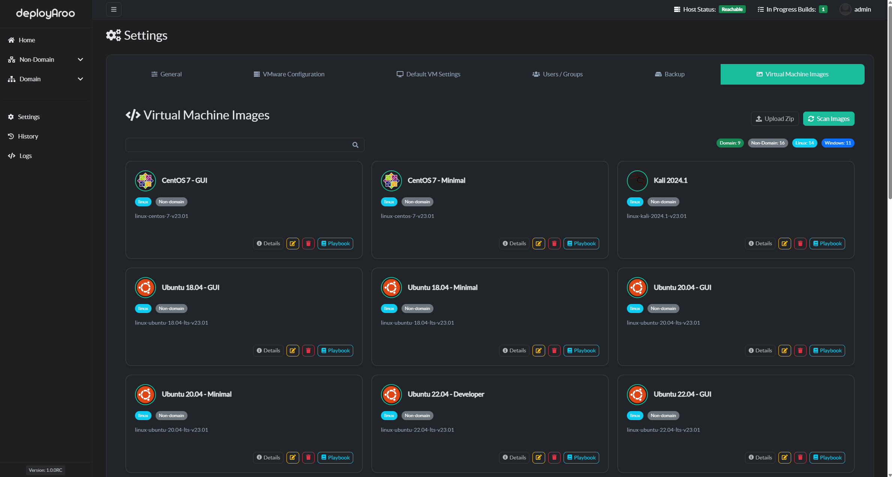

# Initial Setup

Navigate to your deployed Deployaroo web application URL and log in using the credentials you specified during installation.

## 1. Change Your User Password

For security purposes, it's crucial to change your default user password. Go to **Settings > General Tab**, enter your current password, followed by the new password and confirmation password, then press **Change Password**.

---

## 2. Setting Up VMware Configuration

Ensure the VMware configuration is correctly connected; the Host Status in the top menu bar should change to **Reachable**.

### Steps to Configure VMware Configuration

1. **Add IP Address:**
   - Navigate to **Settings > VMware Configuration**.
   - Set the **ESXi Host IP** to the address of the ESXi host where you wish to deploy templates.

2. **Add vCenter DNS Name:**
   - Set the **vCenter DNS Name** to the vCenter server you wish to use.

3. **Add vCenter Username:**
   - Set the **vCenter User** to the username configured during the prerequisites stage.

4. **Add vCenter Password:**
   - Set the **Password** to the vCenter user account password configured during the prerequisites stage.

5. **Test and save:**
   - Press **Test Connection** and ensure you get a successful message before pressing **Update Configuration**.

---

## 3. Setting Up Your Default VM Values

**Default VM Values (Global)**

Configure the default values for your virtual machines to streamline the deployment process. Note that default values are already set for the **Default VM Values** Section. If you need to change them, select the appropriate options, Press **Save Defaults** when you are satisfied. 

**Passwords (Global)**

Ensure you update the **Passwords (Global)** section with the template passwords for both Windows and Linux machines, press **Save Passwords** when you have entered in the passwords that your vm templates use.

---

## 4. Scanning VM Images

### Scan Images

By default images will not appear until after the first scan. On first run of Deployaroo, Please be sure to press **Scan Images**.

Navigate to **Settings > Virtual Machine Images**. Press **Scan Images** to scan for playbooks and ensure they are correctly configured and ready for deployment. Ensure that your template name aligns with the images you intend to deploy. 

As an example: **linux-centos-7-v23.01** should be a virtual machine within your VMware vCenter Server.

Refer to the [prerequisites](../../getting-started/prerequisites) section for template deployment examples.

Tip: Delete any images from the **Virtual Machine Images** section to avoid any confusion. Only keep images that you know have the respective templates in your VMware environment.

---

## 5. Add a Non-Domain and/or Domain Networks

Configure a non-domain network for your virtual machines. This step involves adding network configurations suitable for your environment. Details will vary based on your specific network setup.

View the [Administrator Guide](../../admin-guide/using-the-application) to see how to configure.

---

## Next Step

To continue setting up Deployaroo, please refer to the [Administrator Guide](../../admin-guide/vm-images-management).
