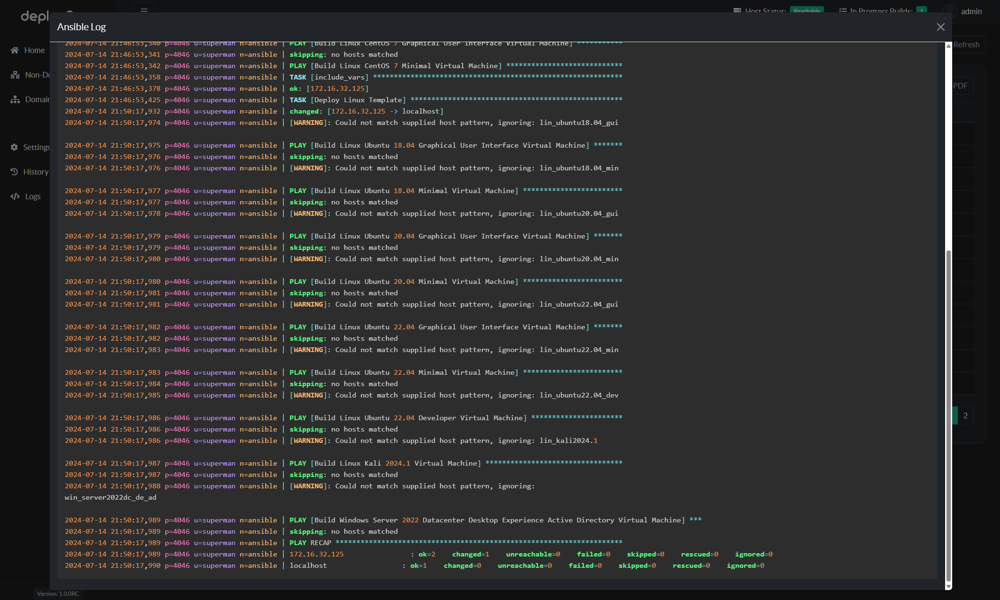

# Deployaroo Screenshots

## Overview

Welcome to the Deployaroo screenshots page! Here you can find visual examples of the Deployaroo interface and its key features.

## Dashboard

*The comprehensive dashboard provides an overview of your virtual machine deployments, including statistics and recent activity.*

## VM Creation

*Effortlessly create a new virtual machine in **Single Mode** Operation*

*Effortlessly create new virtual machines in **Multiple Mode** Operation*

## Deployment History

*Access records of all running, completed, and failed deployments. Export to CSV or PDF.*

*View individual Ansible logs for each machine deployed.*

*View individual full details for each machine deployed.*

## Post Deployment Actions

*Run post post deployment action on your deployed VM's. Such as, Expanding the Disk or Updating the OS.*

## Detailed Logs

*View comprehensive logs for all events within the application. Download the full logs for analysis.*

## User Management

*Manage user access and permissions easily from the User Management interface.*

## Backup & Restore

*Create and restore backups of your data, ensuring your VMware configuration, VM settings, and history are safe and able to be restored if need be.*

## VM Image Management

*See all images currently able to be used within your Deployaroo instance. Manage your VM images and upload custom Ansible playbooks for deployment.*

*Manage and modify your ansible playbooks as needed.*

## Notifications

*Recieve Discord notifications on your vm deployments using webhooks.*

---

For more details on how to deploy and use Deployaroo, visit the [Getting Started](getting-started/overview.md) pages.
